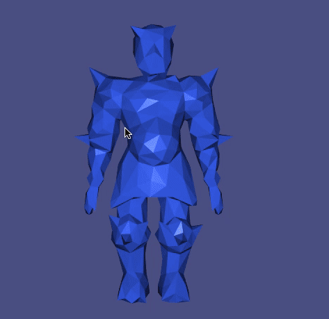
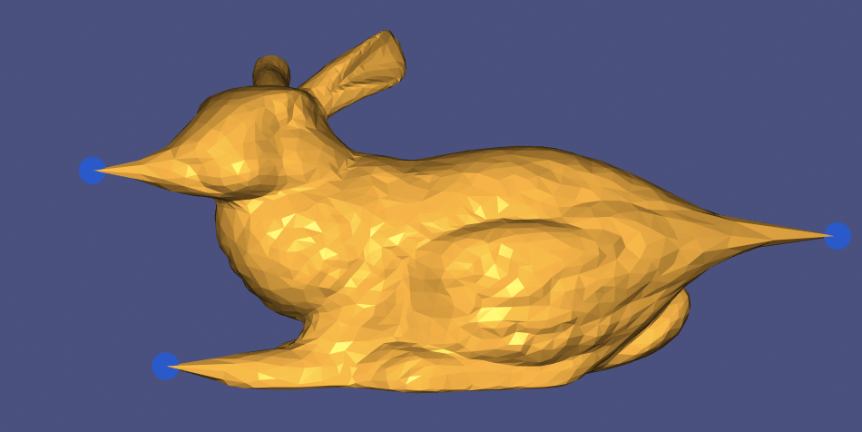
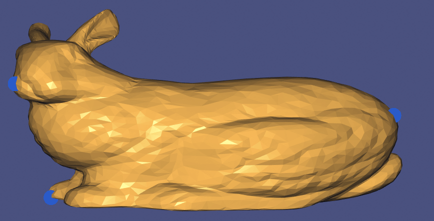
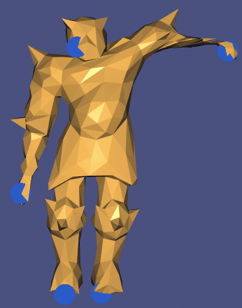
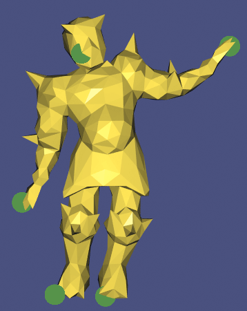

# Geometry Processing - Deformation

> **To get started:** Clone this repository by issuing
> 
>     git clone --recursive http://github.com/alecjacobson/geometry-processing-deformation.git
>

## Installation, Layout, and Compilation

See
[introduction](http://github.com/alecjacobson/geometry-processing-introduction).

## Execution

Once built, you can execute the assignment from inside the `build/` by running
on a given mesh:

    ./deformation [path to mesh.obj]

When the mesh is blue, the system is in "place handles" mode. Click on the mesh
to select vertex locations for control point handles. After pressing space to switch to
deformation mode, drag the handles. Pressing `m` will switch between different
deformation methods.

## Background

In this assignment we explore smooth deformation of an existing shape. [Shape
deformation](https://en.wikipedia.org/wiki/Deformation_(mechanics)) has many
applications in geometry process; we will focus on interactive **_handle-based
deformation_**. In this setup, the user repositions a sparse set of points and the
goal is to propagate the transformation at these "handles" to the rest of the
shape. To be interactive we should aim for computing the new deformation of the
shape at around 30 [frames per
second](https://en.wikipedia.org/wiki/Frame_rate).

Shape deformation is the transformation from its _rest shape_ to a
new/current/deformed shape. If the position of a point on some 3D rest shape
 given by $\widetilde{\mathbf{x}} \in  \mathbb{R}^{3}$ then we will write that the unknown position
on the deformed shape is given by $\mathbf{x} \in  \mathbb{R}^{3}$. We can write this point's
displacement vector as $\mathbf{x} - \widetilde{\mathbf{x}} =: \mathbf{d} \in  \mathbb{R}^{3}$.

The propagation of the handles' deformation can be thought of in two
complementary ways:

 1. as a [scattered data
 interpolation](https://en.wikipedia.org/wiki/Multivariate_interpolation#Irregular_grid_.28scattered_data.29)
 problem, where handles provide sparse samples of an unknown [displacement
 field](https://en.wikipedia.org/wiki/Displacement_field_(mechanics)), or
 2. as a shape optimization problem, where we try to define a _new_ shape that
 retains the details of the old shape but fulfills the handle constraints.

In the following discussion we will take advantage of the ability to switch
between thinking of the unknowns as the positions of the deformed shape (
  $\mathbf{x}$
  )
and displacements (
  $\mathbf{d}$
  ). These views are equivalent, but often one or the
other provides a better intuitive understanding.

#### Continuity

We will limit ourselves to _continuous_ deformations of shapes. That is, the
shape will not tear, crack or change its topological features. 

If we represent our shape discretely as a [triangle
mesh](https://en.wikipedia.org/wiki/Triangle_mesh) (e.g., with _rest_ vertices
in $\widetilde{\mathbf{V}} \in  \mathbb{R}^{n \times  3}$ and faces in $F \in  \{1,\ldots ,n\}^{m \times  3}$, then we can _trivially_
ensure a continuous deformation by determining new vertex positions $\mathbf{V}$. The
topology (connectivity) of the mesh (
  $F$
  ) will not change.

#### Generic Distortion Minimization

A rest surface $\widetilde{S}$
[immersed](https://en.wikipedia.org/wiki/Immersion_(mathematics)) in $\mathbb{R}^{3}$ can
be described as a mapping $\widetilde{\mathbf{x}}$ from _some_ 2D parametric domain ${\Omega}$. For any
parameters $u$ and $v$, $\widetilde{\mathbf{x}}$ describes the 3D position:

$$
\widetilde{\mathbf{x}}(u,v) \in  \mathbb{R}^{3}.
$$

Similarly the deformed surface can be represented as a position function $\mathbf{x}: {\Omega} \Rightarrow  \mathbb{R}^{3}$. The displacement vector field is thus a function taking the
difference: $\mathbf{d}(u,v) = \mathbf{x}(u,v) - \widetilde{\mathbf{x}}(u,v)$.

For the handle-based deformation problem we would like to find a new surface
(defined by $\mathbf{x}$) that:

 1. adds as little _distortion_ as possible to the shape, and 
 2. satisfies the users constraints at selected handle positions.

We can cast this as an energy optimization problem. Suppose we have
energy [functional](https://en.wikipedia.org/wiki/Functional_(mathematics))
$E(\mathbf{x})$ that 
measures the amount of distortion between the new shape 
(
  $\mathbf{x}$
  ) and the rest
shape $\widetilde{x}$, then we could optimize for the best possible shape $\mathbf{x}$ by
minimizing $E$:

$$
\mathop{\text{min}}_\mathbf{x} E(\mathbf{x}). 
$$

To ensure that the user's $k$ handle points are interpolated we add the
constraints:

$$
\text{ subject to } \mathbf{x}(u_i, v_i) = \mathbf{g}_i \ \forall  i = \{1, \ldots  , k\},
$$

where $\mathbf{g}_i$ is the position of the $i$-th control point handle.

While the constraints are straightforward, we have many choices for how to
formulate the energy function $E$. A natural choice is to measure distortion in
an egalitarian way by integrating a _local_ measure of distortion at all points
on the surface:

$$
\mathop{\text{min}}\_\mathbf{x} \int\_{\Omega} ||  e(\mathbf{x}) ||^{2} \ dA \quad \text{ subject to } \mathbf{x}(u\_i, v\_i) = \mathbf{g}\_i \ \forall  i = \{1, \ldots  , k\},
$$

where $e$ is a vector- or scalar- valued function measuring local (unsquared)
distortion. We will now consider different choices for $e$.

### Linear Methods

If we assume that the deformation between the rest shape given by $\widetilde{\mathbf{x}}$
and the new shape given by $\mathbf{x}$ is _small_ then we can measure the distortion
of the deformation in terms of the smoothness of the displacement field. This
simplest methods will integrate the magnitude of derivatives of the
displacement field (
  $\mathbf{d}$
  ): if the displacement field has large variations or
sudden changes then it is inducing a lot of distortion.

#### Gradient-based energy

Let us first consider minimizing the integral of squared variation of the
displacement field:

$$
\mathop{\text{min}}\_\mathbf{d} \int\_{\Omega} ||  {\nabla}\mathbf{d} || \_F^2 \ dA \quad \text{ subject to } \mathbf{d}\_i =
\mathbf{g}\_i-\widetilde{\mathbf{x}}\_i \ \forall  i = \{1, \ldots  , k\},
$$

where 

$$
{\nabla}\mathbf{d} = \left(
  \begin{array}{ccc}
\frac{\partial d^x}{\partial u} & \frac{\partial d^y}{\partial u} & \frac{\partial d^z}{\partial u} \\
\frac{\partial d^x}{\partial v} & \frac{\partial d^y}{\partial v} & \frac{\partial d^z}{\partial v} 
\end{array}
\right)
$$

the [Jacobian](https://en.wikipedia.org/wiki/Jacobian_matrix_and_determinant)
matrix of the displacement field $\mathbf{d}$ 

> ##### Deformation Gradient
>
> If $\mathbf{I} \in  \mathbb{R}^{3 \times  3}$ is the identity matrix, then the quantity $\mathbf{F} := \mathbf{I} + {\nabla}\mathbf{d}$
> is referred to as the [deformation
> gradient](https://en.wikipedia.org/wiki/Finite_strain_theory#Deformation_gradient_tensor)
> in the [mechanics](https://en.wikipedia.org/wiki/Continuum_mechanics)
> community.

This is simply the familiar [Dirichlet
energy](https://en.wikipedia.org/wiki/Dirichlet's_energy) applied to each
coordinate function of the displacement field _independently_.

We can discretize this over our triangle mesh surface the same way we have in
smoothing and parameterization assignments:

$$
{\text{min}}\_{\mathbf{D}} \\, \text{tr}{\left(\mathbf{D}^{\mathsf T} \mathbf{L} \mathbf{D}\right)} \quad \text{subject to } \mathbf{D}\_\text{handles} =
\mathbf{g}\_\text{handles} - \widetilde{\mathbf{V}}\_\text{handles},
$$

where the rows of $\mathbf{g}\_\text{handles} \in  \mathbb{R}^{k \times  3}$ contains the new positions
of the $k$ control point handles.

While easy to implement, this method suffers from a couple immediate problems:

 1. it is not smooth at constraints, and 
 2. then _influence_ of handles dies off too quickly.

By minimizing the Dirichlet energy, each coordinate of "displacement field" is
a [harmonic function](https://en.wikipedia.org/wiki/Harmonic_function).
Intuitively (however abstractly) we can think of each function as _diffusing_
the user's constraints as if they were
[heat](https://en.wikipedia.org/wiki/Heat_equation) values. As such, each
function diffuses quickly to an average, slowly varying value over most of the
domain. As a displacement field a constant value for each coordinate function
would mean a translation: most of the shape is simply translated.

The gradient operator (
  ${\nabla}$
  ) is a [_linear_
operator](https://en.wikipedia.org/wiki/Linear_map). We can alternatively view
our minimization above in terms of the unknown positions $\mathbf{x}$:

$$
\mathop{\text{min}}\_\mathbf{d} \int\_{\Omega} ||  {\nabla}\mathbf{d} || \_F^2 \ dA \Rightarrow  
\mathop{\text{min}}\_\mathbf{x} \int\_{\Omega} ||  {\nabla}(\mathbf{x} - \widetilde{\mathbf{x}}) || \_F^2 \ dA \Rightarrow  
\mathop{\text{min}}\_\mathbf{x} \int\_{\Omega} ||  \underbrace{{\nabla}\mathbf{x}}\_\text{after} -
\underbrace{{\nabla}\widetilde{\mathbf{x}}}\_\text{before} || \_F^2 \ dA.
$$

If we think of the gradient of the position function ${\nabla}\mathbf{x}$ (with respect to the
underlying parameterization $u,v$) as a local geometric [feature
descriptor](https://en.wikipedia.org/wiki/Feature_(computer_vision)) then this
energy can be re-understood as measuring the difference in this feature before
and after the deformation. This is very sensible as we are trying to measure
distortion. We would expect that a low-distortion deformation would correspond
with a small change to local features.

Unfortunately, the gradient of the position function $\mathbf{x}$ is a _poor_,
first-order local feature.

#### Laplacian-based energy

If we model distortion as the change in a local feature descriptor, then a
natural local and _relative_ descriptor would be one that compared the position
of some point on the shape to the average of its local neighborhood. We have
studied an operator that computes this in the smoothing assignment. The
[Laplace(-Beltrami) operator](https://en.wikipedia.org/wiki/Laplace_operator)
can be derived as taking exactly the difference of a functions value at a point
and the average (i.e., [centroid](https://en.wikipedia.org/wiki/Centroid)) of
an infinitesimal region around that point:

$$
\Delta  f(\mathbf{x}) = \lim_{|B(\mathbf{x})| \rightarrow  0} \frac{1}{|B(\mathbf{x}))|} \int_{B(\mathbf{x})} f(\mathbf{z}) \\, \\, d\mathbf{z} - f(\mathbf{x})
$$

(see, e.g., ["Differential coordinates for local mesh morphing and deformation"
[Alexa et al. 2003]](papers/Alexa04.pdf) and expanded upon in ["Laplacian Surface Editing"
[Sorkine et al. 2004]](papers/laplacian-surface-editing.pdf)).

When applied to the embedding function $\mathbf{x}$ the Laplace operator computes the
difference in _position_ between a point and its local neighborhood. This
_vector_ points in the
[normal](https://en.wikipedia.org/wiki/Normal_(geometry)) direction and its
magnitude corresponds inversely with [how flat the surface is
locally](https://en.wikipedia.org/wiki/Mean_curvature).

Let's replace the gradient feature above with this _second-order_ feature
descriptor and massage our optimization problem back in terms of
displacements:

$$
\mathop{\text{min}}\_\mathbf{x} \int\_{\Omega} ||  \underbrace{\Delta \mathbf{x}}\_\text{after} -
\underbrace{\Delta \widetilde{\mathbf{x}}}\_\text{before} || ^2 \ dA \Rightarrow 
\mathop{\text{min}}\_\mathbf{x} \int\_{\Omega} ||  \Delta (\mathbf{x} - \widetilde{\mathbf{x}}) || ^2 \ dA \Rightarrow  
\mathop{\text{min}}\_\mathbf{d} \int\_{\Omega} ||  \Delta \mathbf{d} || ^2 \ dA.
$$

Just as we can show that harmonic functions ( $\Delta \mathbf{d} = 0$ ) minimize the Dirichlet
energy, we can use [calculus of
variations](https://en.wikipedia.org/wiki/Calculus_of_variations) apply
[Green's identity](https://en.wikipedia.org/wiki/Green's_identities) _twice_ to
show that minimizers of the squared-Laplacian energy are _bi-harmonic_
functions (
  $\Delta \Delta \mathbf{d} = 0$ or $\Delta ^{2}\mathbf{d} = 0$
  ). Obviously all harmonic functions are also
biharmonic functions. This implies that the space of biharmonic functions is
strictly _larger_. In particular, this will allow use to ensure continuity of
first derivatives across constrained values at handles.

The fact that each coordinate of the displacement field $\mathbf{d}$ will be a
bi-harmonic function is not so elucidating, but by minimizing the
squared-Laplacian energy integrated over the domain, we can say that it is
as-_harmonic_-as-possible. Harmonic functions include constant functions (i.e.,
translations) but also any displacement that _bends_ in one direction by an
equal and opposite amount as it bends in the other direction: 
$\Delta \mathbf{d} = 0 \rightarrow  \partial \mathbf{d}/\partial u + \partial \mathbf{d}/\partial v = 0 \rightarrow  \partial \mathbf{d}/\partial u = -\partial \mathbf{d}/\partial v$.

To discretize this energy we can make use of our discrete Laplacian operator
$\mathbf{L}$. This matrix computes the locally _integrated_ Laplacian of a given
function specified by per-vertex values $\mathbf{f}$. Now we would like to integrate
the square of the _point-wise_ Laplacian. We can approximate the point-wise
Laplacian by the local [integral
average](https://en.wikipedia.org/wiki/Mean_of_a_function) of the Laplacian
$\mathbf{M}^{-1}\mathbf{L} \mathbf{f}$. Integrating this over the mesh we have our complete approximate
of the energy:

$$
\begin{align*}
\int\_{\Omega} || \Delta \mathbf{d}||^{2} \\, \\, dA &\approx  \text{tr}{\left( \mathbf{D}^{\mathsf T} \mathbf{L}^{\mathsf T} \mathbf{M}^{-{\mathsf T}} \mathbf{M} \mathbf{M}^{-1} \mathbf{L}
\mathbf{D} \right)} \\
&= \text{tr}{\left( \mathbf{D}^{\mathsf T} \underbrace{\mathbf{L}^{\mathsf T} \mathbf{M}^{-1} \mathbf{L}}\_{\mathbf{Q}} \mathbf{D} \right)},
\end{align*}
$$

where $\mathbf{M} \in  \mathbb{R}^{n \times  n}$ is the mass-matrix for the given mesh and $\mathbf{Q} \in \mathbb{R}^{n\times n}$ can be thought of as the bi-Laplacian matrix.

> #### $k$-harmonic
> 
> The logical continuation of harmonic and biharmonic deformation is to consider
> _triharmonic_ (
> $\Delta ^{3}\mathbf{d} = 0$
> ) and _tetraharmonic_ (
> $\Delta ^{4}\mathbf{d} = 0$
> ) and so on. It's
> straightforward to implement these, though there are diminishing returns and
> increasing costs.

##### Precomputation

With out loss of generality, assume that the rows of the unknown displacements
$\mathbf{D}$ have been sorted so that displacements corresponding to handle vertices
are in the bottom part:

$$
\mathbf{D} = \left(\begin{array}{c}
\mathbf{D}\_\text{u} \\
\mathbf{D}\_\text{h}
\end{array}
\right)
$$

Since the displacements at handles are _known_ before the optimization, we can
separate the knowns and unknowns in the energy:

$$
\mathop{\text{min}}\_{\mathbf{D}\_\text{u}} \\, \\,
\text{tr}\left( {(\mathbf{D}\_\text{u}^{\mathsf T} \ \mathbf{D}\_\text{h}^{\mathsf T})
\left(\begin{array}{cc}
\mathbf{Q}\_\text{u,u} & \mathbf{Q}\_\text{u,h} \\
\mathbf{Q}\_\text{h,u} & \mathbf{Q}\_\text{h,h} 
\end{array}\right)
\left(\begin{array}{c}
  \mathbf{D}\_\text{u} \\
  \mathbf{D}\_\text{h}
\end{array}
\right)} \right)
$$

$$
\mathop{\text{min}}\_{\mathbf{D}\_\text{u}}  \\, \\,
\text{tr} \left({\mathbf{D}\_\text{u}^{\mathsf T} \mathbf{Q}\_\text{u,u} \mathbf{D}\_\text{u} +
2 \mathbf{D}\_\text{u}^{\mathsf T} \mathbf{Q}\_\text{u,h} \mathbf{D}\_\text{h} + 
\underbrace{\mathbf{D}\_\text{h}^{\mathsf T} \mathbf{Q}\_\text{h,h}
\mathbf{D}\_\text{h}}\_\text{constant}}\right)
$$

$$
\mathop{\text{min}}\_{\mathbf{D}\_\text{u}}  \\, \\,
\text{tr} \left({
\mathbf{D}\_\text{u}^{\mathsf T} \mathbf{Q}\_\text{u,u} \mathbf{D}\_\text{u} +
2 \mathbf{D}\_\text{u}^{\mathsf T} \mathbf{Q}\_\text{u,h} \mathbf{D}\_\text{h}} \right)
$$

where $\mathbf{Q}\_\text{u,u} \in  \mathbb{R}^{(n-k) \times  (n-k)}$ is the quadratic coefficients matrix
corresponding to the unknown displacements.

This quadratic optimization problem may solved by setting all partial
derivatives with respect to degrees of freedom in $\mathbf{D}\_\text{u}$ to zero:

$$
2 \mathbf{Q}\_\text{u,u} \mathbf{D}\_\text{u} + 2 \mathbf{Q}\_\text{u,h} \mathbf{D}\_\text{h}
= 0 \rightarrow  \mathbf{D}\_\text{u} = \mathbf{Q}\_\text{u,u}^{-1} \mathbf{Q}\_\text{u,h} \mathbf{D}\_\text{h}
$$

If we don't change _which_ vertices are handles, but only change the positions
of the selected handles, then only $\mathbf{D}\_\text{h}$ changes above. In particular,
the matrix $\mathbf{Q}\_\text{u,u}$ is unchanged. Therefore, we can
[prefactorize](https://en.wikipedia.org/wiki/Cholesky_decomposition) it so that
_applying its inverse_ is fast (`igl::min_quad_with_fixed` does this for you).

> Actually the entire term $\mathbf{Q}\_\text{u,u}^{-1}\mathbf{Q}\_\text{u,h} =: \mathbf{W} \in  \mathbb{R}^{(n-k)\times  k}$ does not change. The columns of $\mathbf{W}$ reveal how unknown displacements
> respond to each handle point's displacement (see also "An intuitive framework
> for real-time freeform modeling" [Botsch & Kobbelt 2004]). This provides a
> gateway to the relationship with linear blend skinning and automatic
> (biharmonic) weighting functions (see "Bounded Biharmonic Weights for
> Real-Time Deformation" [Jacobson et al. 2011]).

##### Trouble in paradise 

Biharmonic displacements work well for small deformations and deformations that
do not imply a large rotation. However, the Laplacian of the position function
$\Delta \mathbf{x}$ as a feature descriptor is _not_ rotation invariant. This problem is true
for all linear differential features including the gradient of the embedding
function ${\nabla}\mathbf{x}$ considered above (see "On linear variational surface deformation
methods" [Botsch & Sorkine 2008]).

This means that if the user transforms all of the handle locations by a rigid
transformation $\mathbf{T}$ these energies will _not_ measure zero for a displacement
equivalent to applying the rigid transformation $\mathbf{T}$ to the entire shape. We
would like _global_ rotation invariance, but we would also like this property
to apply _locally_ so that parts of the shape can easily rotate.

### As-rigid-as-possible

In the scenario where each handle
$i$ are perfectly transformed by a [rigid
transformation](https://en.wikipedia.org/wiki/Rigid_transformation) $\mathbf{x}\_i =\mathbf{R} \widetilde{\mathbf{x}}\_i + \mathbf{t}$, where $\mathbf{R} \in  SO(3) \subset  \mathbb{R}^{3\times 3}$ is a rotation matrix and
$\mathbf{t}\in \mathbb{R}^3$ is a translation vector. If an
[oracle](https://en.wikipedia.org/wiki/Oracle) could only tell us this
particular rigid transformation then we could repair 
the gradient-based energy above by pre-rotating the rest shape by this
transformation:

$$
\begin{align*}
\int\_{\Omega} ||  {\nabla} \mathbf{x} - {\nabla}(\mathbf{R} \widetilde{\mathbf{x}} + \mathbf{t}) ||^{2} \\, \\, dA 
  &= \int\_{\Omega} ||  {\nabla} \mathbf{x} - {\nabla}(\mathbf{R} \widetilde{\mathbf{x}}) - {\nabla}\mathbf{t}||^{2} \\, \\, dA \\
  &= \int\_{\Omega} ||  {\nabla} \mathbf{x} - \mathbf{R} {\nabla}\widetilde{\mathbf{x}} ||^{2} \\, \\, dA,
\end{align*}
$$

where the translation vector $\mathbf{t}$ falls out because a translation has constant
gradient.

We do not know the rotation $\mathbf{R}$ ahead of time, but we could be as generous
as possible and use the "best" rotation $\mathbf{R}\leftarrow  \mathop{\text{argmin}}\_\mathbf{R} \int\_{\Omega} ||  {\nabla}\mathbf{x} -  \mathbf{R}{\nabla}\widetilde{\mathbf{x}} ||^{2} \\, \\, dA$:

$$
\int\_{\Omega} ||{\nabla}\mathbf{x} - \left( \mathop{\text{argmin}}\_\mathbf{R} \int\_{\Omega} ||  {\nabla}\mathbf{x} -  \mathbf{R} {\nabla}\widetilde{\mathbf{x}} ||^{2} \\, \\, dA \right){\nabla}\widetilde{\mathbf{x}}||^{2} \\, \\, dA.
$$

If we treat $\mathbf{R}$ as a degree of freedom along with the unknown positions
$\mathbf{x}$, we can unify this into an optimization over $\mathbf{x}$ and $\mathbf{R}$:

$$
\mathop{\text{min}}\_{\mathbf{x},\mathbf{R}\in SO(3)} \int\_{\Omega} ||{\nabla}\mathbf{x} - \mathbf{R} {\nabla}\widetilde{\mathbf{x}}||^{2} \\, \\, dA.
$$

Optimizing this energy will ensure _global_ rotation invariance. To ensure
_local_ rotation invariance, we can replace $\mathbf{R} \in  SO(3)$ with a spatially
varying _function_ $\mathbf{R} : {\Omega} \rightarrow  SO(3)$ that outputs a "best" rotation for any
point on the shape (see ["A simple geometric model for elastic deformations"
[Chao et al. 2010]](papers/GeomElastic.pdf)). In this way, the optimal rotation will be locally rigid
everywhere, or _as-rigid-as-possible_ (ARAP).

> For embedded solid shapes, we can take the rest shape given by $\widetilde{\mathbf{x}}$ as
> the parameterization ${\Omega}$, so that ${\nabla}\widetilde{\mathbf{x}} = \mathbf{I}$. This allows us to rewrite
> the as-rigid-as-possible energy as the square of the difference between the
> [deformation gradient](#deformationgradient) and the closest rotation:
>
$$
\int_{\Omega} ||{\nabla}\mathbf{x} - \mathbf{R} {\nabla}\widetilde{\mathbf{x}}||^{2} \\, \\, dA
$$

$$
\int_{\Omega} ||({\nabla}\mathbf{x} + \mathbf{I} - \mathbf{I}) - \mathbf{R} \mathbf{I} ||^{2} \\, \\, dA
$$

$$
\int_{\Omega} ||(\mathbf{I} + {\nabla}\mathbf{x} - {\nabla}\widetilde{x}) - \mathbf{R} ||^{2} \\, \\, dA
$$

$$
\int_{\Omega} ||(\mathbf{I} + {\nabla}\mathbf{d}) - \mathbf{R} ||^{2} \\, \\, dA
$$

$$
\int_{\Omega} ||\mathbf{F} - \mathbf{R} ||^{2} \\, \\, dA
$$

>
> This form provides a bridge between the as-rigid-as-possible energy common in
> geometry processing to _corotated linear elasticity_ used in
> mechanics/physically-based simulation (made explicit in "A simple geometric
> model for elastic deformations" [Chao et al. 2010]). See Section 3.4 of "FEM
> Simulation of 3D Deformable Solids" [Sifakis 2012] for a graphics-mechanics
> perspective.
>

#### Discrete as-rigid-as-possible energy

For a triangle mesh with displacing vertices, the gradient of the embedding
function is constant inside each triangle. In this way we can write the raw
gradient energy above as a double sum over all half-edges $ij$ of all faces $f$
in the mesh:

$$
\frac12  \int_{\Omega} 
||  {\nabla} \mathbf{x} - {\nabla}\widetilde{\mathbf{x}}||^{2} \\, \\, dA = 
\frac12  
\sum\limits_{f \in  F} 
\sum\limits_{ ij \in  f} c_{ij} || 
(\mathbf{v}_i-\mathbf{v}_j) - (\widetilde{\mathbf{v}}_i-\widetilde{\mathbf{v}}_j)||^{2},
$$

where $c_{ij}$ is cotangent of the angle opposite half-edge $ij$.

To inject localized best fit rotations, we will assign an unknown rotation
matrix $\mathbf{R}\_k$ to each vertex $k$ of the mesh and accounts for a third of the
energy integrated over incident triangles:

$$
\frac12  \int\_{\Omega} ||  {\nabla} \mathbf{x} - \mathbf{R} {\nabla}\widetilde{\mathbf{x}}||^{2} \\, \\, dA = 
\frac{1}{6} \sum\limits\_{k=1}^n \sum\limits\_{ ij \in  F(k)} 
c\_{ij} ||  (\mathbf{v}\_i-\mathbf{v}\_j) - \mathbf{R}\_k (\widetilde{\mathbf{v}}\_i-\widetilde{\mathbf{v}}\_j)||^{2},
$$

where $F(k)$ is the set of all faces incident on the $k$-th vertex.

> ##### Where do rotations _live_?
> We have assigned a rotation for each vertex: there are $n$ rotation matrices
> as auxiliary degrees of freedom. This is in contrast to assigning
> rotations per face (as in "A Local/Global Approach to Mesh Parameterization"
> [Liu et al. 2008]). Per-face--or more generally per-element--rotations work
> well for [codimension](https://en.wikipedia.org/wiki/Codimension) zero
> objects (triangle meshes in $\mathbb{R}^{2}$ or tetrahedral meshes in $\mathbb{R}^{3}$). But for
> triangle mesh surfaces in $\mathbb{R}^{3}$ (i.e., codimension 1), per-face rotations
> would lead to "crumpling") because _bending_ along edges would not be
> measured.

#### Optimization

The simplest method for optimizing the ARAP energy is by alternating between

 1. finding the optimal rotations $\mathbf{R}_k$ assuming the vertex positions $\mathbf{V}$ are
 fixed, and
 2. finding the optimal vertex positions $\mathbf{V}$ assuming all rotations $\mathbf{R}_k$ are
 fixed.

Each rotation $\mathbf{R}_k$ only affects the local energy and doesn't interact with
the _other_ rotations. So each can be optimized _locally_. In contrast, the
mesh vertex positions $\mathbf{V}$ depend on each other requiring a _global_ solve. In
the geometry processing literature, this is known as a local-global
optimization (see ["As-rigid-as-possible surface modeling" [Sorkine & Alexa
2007]](papers/arap_web.pdf)). It is also known as "alternating block coordinate descent" because we
have separated the variables into disjoint sets ( $\mathbf{V},\mathbf{R}\_1,\ldots ,\mathbf{R}\_n$ ) and taking
the optimal descent direction for each independently.

Observing the discrete energy above we can see that the energy is quadratic in
$\mathbf{V}$ and quadratic in each $\mathbf{R}_k$. Let's start by separating the terms that are
quadratic and linear in $\mathbf{V}$:

$$
\frac{1}{6} \underbrace{\sum\limits\_{k=1}^n \sum\limits\_{ ij \in  F(k)}  c\_{ij} (\mathbf{v}\_i-\mathbf{v}\_j)^{\mathsf T}(\mathbf{v}\_i-\mathbf{v}\_j)}\_\text{quadratic}
+
\frac{1}{6} \underbrace{\sum\limits\_{k=1}^n \sum\limits\_{ ij \in  F(k)}  c\_{ij} (\mathbf{v}\_i-\mathbf{v}\_j)^{\mathsf T} \mathbf{R}\_k (\widetilde{\mathbf{v}}\_i-\widetilde{\mathbf{v}}\_j)}\_\text{linear}
$$

if we stack the rotation matrices $\mathbf{R}\_k$ into large matrix $\mathbf{R} \in  \mathbb{R}^{3n \times 3}$ then we can write this energy in matrix form as:

$$
\text{tr}{\left( \mathbf{V}^{\mathsf T} \mathbf{L} \mathbf{V} \right)} + \text{tr}{\left( \mathbf{V}^{\mathsf T} \mathbf{K} \mathbf{R} \right)},
$$

where $\mathbf{L} \in  \mathbb{R}^{n \times  n}$ is the familiar cotangent discrete Laplacian matrix and
$\mathbf{K} \in  \mathbb{R}^{n \times  3n}$ sparse matrix containing cotangents multiplied against
differences across edges in the rest mesh (e.g., $\widetilde{\mathbf{v}}\_i - \widetilde{\mathbf{v}}\_j$).

> ###### I'm so confused. What's in the $\mathbf{K}$ matrix?
> 
> Let's take it slow. The $\mathbf{K}$ matrix is represents the
> [bilinear form](https://en.wikipedia.org/wiki/Bilinear_form) that combines unknown 
> vertex positions and unknown rotations. We have identified above that we can
> write this in summation or matrix form:
>
> $$
\frac{1}{6} \sum\limits\_{k=1}^n \sum\limits\_{ ij \in  F(k)}  c\_{ij} (\mathbf{v}\_i-\mathbf{v}\_j)^{\mathsf T} \mathbf{R}\_k (\widetilde{\mathbf{v}}\_i-\widetilde{\mathbf{v}}\_j)
= \text{tr}{\left( \mathbf{V}^{\mathsf T} \mathbf{K} \mathbf{R} \right)},
$$
>
> but how did we get here?
> 
> Let's start with the summation form. The _constants_ of this formula are the
> $c\_{ij}$ terms and the $(\widetilde{\mathbf{v}}\_i-\widetilde{\mathbf{v}}\_j)$ terms. Since these always
> appear together, let us merge them into weighted edge difference vectors
> $c\_{ij} (\widetilde{\mathbf{v}}\_i-\widetilde{\mathbf{v}}\_j) =: \widetilde{\mathbf{e}}\_{ij} \in  \mathbb{R}^{3}$:
> 
> $$
\frac{1}{6} \sum\limits\_{k=1}^n \sum\limits\_{ ij \in  F(k)}  \underbrace{(\mathbf{v}\_i-\mathbf{v}\_j)^{\mathsf T}
\mathbf{R}\_k \widetilde{\mathbf{e}}\_{ij}}\_{\in \mathbb{R}},
$$
>
> the inner term in the summation is an [inner
> product](https://en.wikipedia.org/wiki/Inner_product_space); that is, a
> [scalar](https://en.wikipedia.org/wiki/Scalar_(mathematics)). Let's expose this
> by expanding the matrix-vector products of the inner-product:
> 
> $$
\frac{1}{6} \sum\limits\_{k=1}^n \sum\limits\_{ ij \in  F(k)} \sum\limits\_{{\alpha}=1}^3 \sum\limits\_{{\beta}=1}^3
(v\_i^{\alpha} - v\_j^{\alpha})R\_k^{{\alpha}{\beta}}\widetilde{e}\_{ij}^{\beta}.
$$
>
> If our mesh is stored as a vertex list and face list, it's not easy/efficient
> to loop over per-vertex rotations (outer sum) and then over all half-edges of
> incident faces (second sum). Instead, let's rearrange these sums to loop over
> all faces first, then the half-edges of that face, and then over all
> per-vertex rotations that involve this half-edge:
> 
> $$
\frac{1}{6} \sum\limits\_{f=1}^m \sum\limits\_{ ij \in  E(f)} \quad  \sum\limits\_{k | ij \in F(k)} \quad \sum\limits\_{{\alpha}=1}^3 \sum\limits\_{{\beta}=1}^3
(v\_i^{\alpha} - v\_j^{\alpha})R\_k^{{\alpha}{\beta}}\widetilde{e}\_{ij}^{\beta},
$$
>
> where the third sum is over all rotations $k$ such that the half-edge $ij$
> belongs to the half-edges of the faces incident on the $k$-th vertex: $k | ij \in F(k)$. Well, this means $k$ can either be $i$ or $j$ or the third vertex of
> the $f$-th face.
> 
> Now let's turn our attention back to the
> [summand](https://en.wiktionary.org/wiki/summand). The terms indexed by ${\alpha}$
> never _mix_. That is, we never add/multiply $v_i^{\alpha}$, $v_j^{\gamma}$, and $R_k^{{\delta}{\beta}}$
> unless ${\alpha}={\gamma}={\delta}$. This implies that we can write this summation in matrix form
> as:
> 
> $$
\mathbf{V}\_{1}^{\mathsf T} \mathbf{K}\_{1} \mathbf{R}\_{1} +  
\mathbf{V}\_{2}^{\mathsf T} \mathbf{K}\_{2} \mathbf{R}\_{2} +  
\mathbf{V}\_{3}^{\mathsf T} \mathbf{K}\_{3} \mathbf{R}\_{3},
$$
>
> where $\mathbf{V}\_{\alpha} \in  \mathbb{R}^n$ is ${\alpha}$-th column of $\mathbf{V}$, $\mathbf{R}\_{\alpha} \in  \mathbb{R}^{3n}$ is the ${\alpha}$-th column of
> $\mathbf{R}$ and $\mathbf{K}\_{1},\mathbf{K}\_{2},\mathbf{K}\_{3} \in  \mathbb{R}^{n \times  3n}$ are sparse matrices.
> 
> _Further_, the constant term $\widetilde{e}^{\beta}_{ij}$ in the summation acts the same on
> $(v\_i^{\alpha} - v\_j^{\alpha})R\_k^{{\alpha}{\beta}}$ for any ${\alpha}$ value. This implies that $\mathbf{K}\_{1}=\mathbf{K}\_{2}=\mathbf{K}\_{3}$,
> so we can reduce the matrix form to:
> 
> $$
\text{tr}{\left(\mathbf{V} \mathbf{K} \mathbf{R}\right)}.
$$
> 
> Finally, we can answer what is in each entry $K\_{vw}$, where $v$ chooses the
> row and $w=3k+{\beta}$ chooses the column of $\mathbf{K}$. Treating our nested summation as
> nested for-loops, we can increment entries in $\mathbf{K}$
> 
> $$ 
\begin{align*}
K\_{i\ 3k+{\beta}} & \mathrel{+}= \widetilde{e}\_{ij}^{\beta}, \\
K\_{j\ 3k+{\beta}} & \mathrel{+}= -\widetilde{e}\_{ij}^{\beta}, \\
\end{align*}
$$
>
> for each half-edge encountered. 

##### Local step

Minimizing this energy with respect $\mathbf{R}$ corresponds to minimizing:

$$
\text{tr}{\left( \underbrace{\mathbf{V}^{\mathsf T} \mathbf{K}}\_{\mathbf{C}^{\mathsf T}} \mathbf{R} \right)},
$$

where $\mathbf{C} \in  \mathbb{R}^{3n \times  3}$ stacks weighted covariance matrices $\mathbf{C}\_k \in  \mathbb{R}^{3 \times 3}$ for each region _covered_ by the corresponding rotation $\mathbf{R}_k$. We have
seen this problem before in the registration assignment. For each $\mathbf{C}_k$,
$\mathbf{R}_k$ will be the closest rotation matrix solved via [singular value
decomposition](https://en.wikipedia.org/wiki/Singular_value_decomposition).

##### Global step

Minimizing the energy above with respect to $\mathbf{V}$ corresponds to solving a
Dirichlet energy-like minimization problem:

$$
{\text{min}}_\mathbf{V} \\, \text{tr}{\left( \mathbf{V}^{\mathsf T} \mathbf{L} \mathbf{V} \right)} + \text{tr}{\left( \mathbf{V}^{\mathsf T} \mathbf{B} \right)}
$$

where $\mathbf{K} \mathbf{R} =: \mathbf{B} \in  \mathbb{R}^{n \times  3}$ is a matrix of rotated vertex gradients.
Adding the handle constraints to the corresponding rows of $\mathbf{V}$ this is easily
minimized by setting all partial derivatives with respect to the unknowns in
$\mathbf{V}$ equal to zero (as in the linear methods above).

##### Implementation

In order to facilitate interactive deformation we would like our local and
global iterations to be computed as quickly as possible. Since the quadratic
form in the global step is the _same_ regardless of the current rotations or
current handle positions, we can
[prefactorize](https://en.wikipedia.org/wiki/Cholesky_decomposition) it (again,
as above). The matrix $\mathbf{K}$ also does not depend on the rotations, current
positions or handle positions, so we can pre-build this matrix. This way
computing $\mathbf{C}$ and $\mathbf{B}$ is a simple matrix-matrix multiplication.

> **Note:** When constructing $\mathbf{K}$ it's easiest to iterate over _all_
> half-edges in the mesh (by iterating over all faces and then each of the
> three edges). Each half-edge $ij$ _contributes_ terms tying $\mathbf{v}_i,\mathbf{v}_j$ to
> _each_ of the (three) rotations $\mathbf{R}_k$ that apply against their difference
> (see "Fast Automatic Skinning Transformations" [Jacobson et al. 2012]).

##### Still trouble in paradise

The as-rigid-as-possible deformation method for surfaces described above has a
number of remaining problems:

 1. like its gradient-based energy ancestor the deformation is not smooth at
 constraints;
 2. the energy punishes _bending_ of the surface--which is good--but does so in
 a way that diminishes as the mesh becomes higher and higher resolution, in
 otherwords, the discrete energy is mesh-resolution dependent; and
 3. the energy is biased by the original combinatorics of the mesh (even in
 flat regions).

## Tasks

### Blacklist

 - `igl::arap`
 - `igl::arap_linear_block`
 - `igl::covariance_scatter_matrix`
 - `igl::harmonic`

### Whitelist

 - `igl::polar_svd3x3` (or your previous assignment's `closest_rotation`)
 - `igl::min_quad_with_fixed` 
 - `igl::cotmatrix_entries` 
 - `igl::cotmatrix`  (or your previous implementation)
 - `igl::massmatrix`  (or your previous implementation)

### `source/biharmonic_precompute.cpp`

Precompute data needed to efficiently solve for a biharmonic deformation given
a mesh with vertices `V` and faces `F` and a list of selected vertices as
indices `b` into `V`. The output should be a prefacorized system using the
`data` struct employed by `igl::min_quad_with_fixed`.

### `source/biharmonic_solve.cpp`

Given precomputation `data` and a list of handle _displacements_ determine
_displacements_ for all vertices in the mesh.

### `source/arap_precompute.cpp`

Precompute data needed to efficiently conduct local-global iterations for an
arap deformation. This includes the `data` struct employed by
`igl::min_quad_with_fixed` to solve the global step" and constructing the
bilinear form `K` that mixes rotation degrees of freedom with unknown
positions for preparing the covariance matrices of the local step and the
linear term of the global step.

### `source/arap_single_iteration.cpp`

Given precomputed data (`data` and `K`), handle _positions_ `bc` and current
positions of all vertices `U`, conduct a _single_ iteration of the local-global
solver for minimizing the as-rigid-as-possible energy. Output the _positions_
of all vertices of the mesh (by overwriting `U`).
